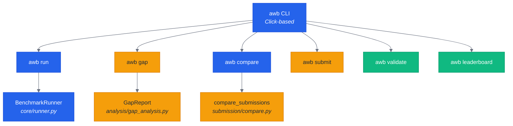
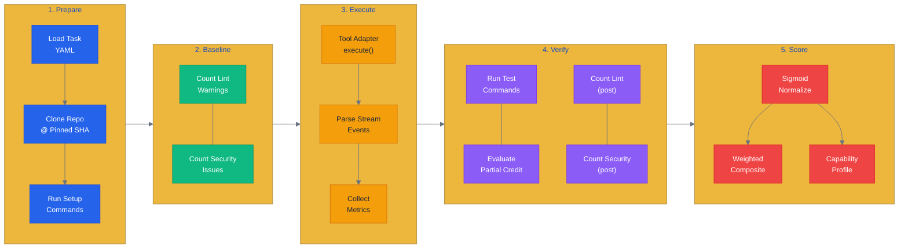
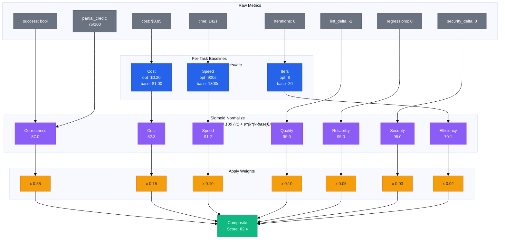
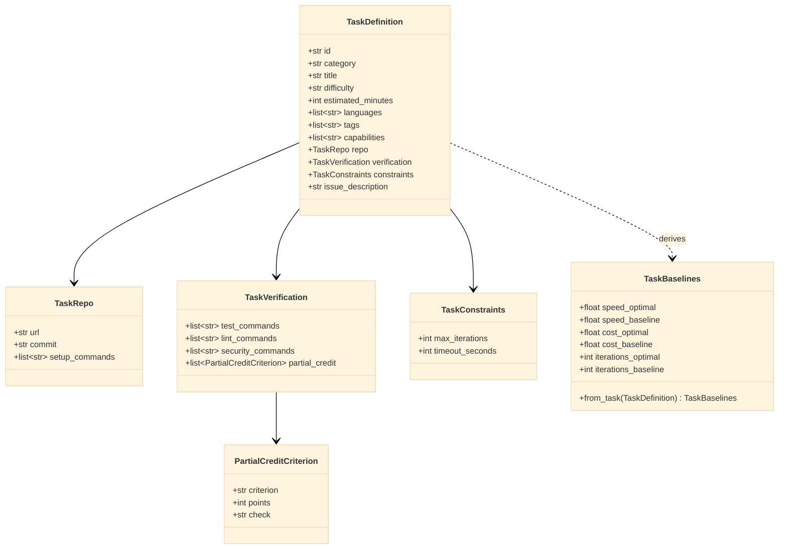
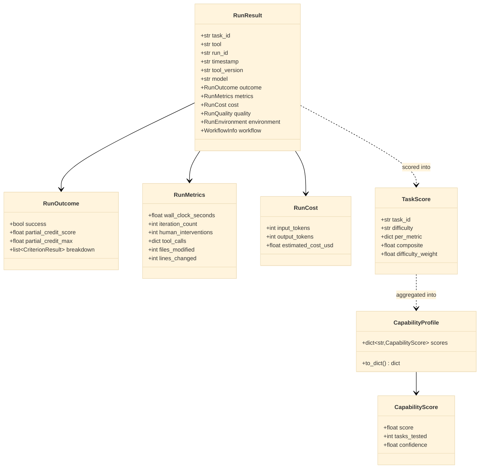
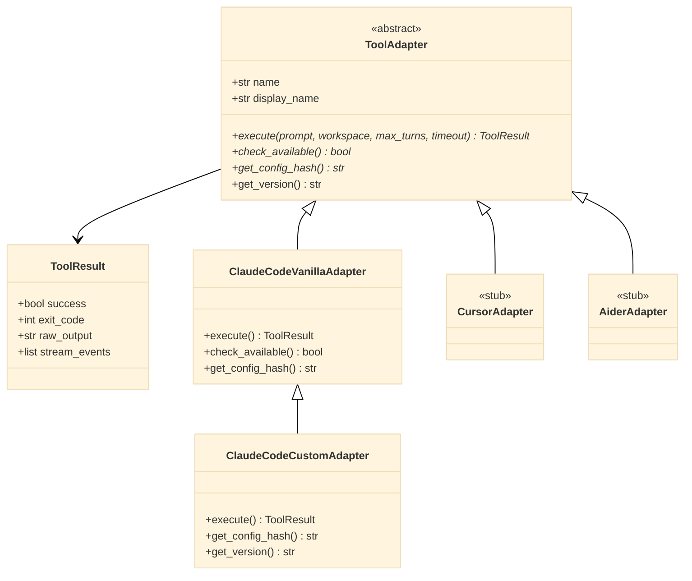

# AWB Architecture

## System Overview



## Benchmark Run Pipeline

The core execution flow from task selection to scored result:



## Module Dependency Graph

```mermaid
%%{init: {'theme': 'base', 'themeVariables': {'fontSize': '13px', 'lineColor': '#6b7280'}}}%%
graph TD
    subgraph CLI_Layer["CLI Layer"]
        CLI["cli.py"]:::blue
    end

    subgraph Core["Core"]
        Config["config.py<br/><i>Dataclasses,<br/>weights, paths</i>"]:::gray
        TaskLoader["task_loader.py<br/><i>YAML + schema<br/>validation</i>"]:::gray
        Runner["runner.py<br/><i>Async orchestrator</i>"]:::gray
        RepoMgr["repo_manager.py<br/><i>Git clone + setup</i>"]:::gray
        Results["results.py<br/><i>JSON save/load</i>"]:::gray
        MetricCol["metrics.py<br/><i>Token counting,<br/>timing</i>"]:::gray
    end

    subgraph Adapters["Adapters"]
        Base["base.py<br/><i>ToolAdapter ABC</i>"]:::orange
        Registry["registry.py"]:::orange
        CCVanilla["claude_code.py<br/><i>Vanilla</i>"]:::orange
        CCCustom["claude_code.py<br/><i>Custom</i>"]:::orange
    end

    subgraph Verification["Verification"]
        TestRun["test_runner.py"]:::green
        PartialC["partial_credit.py"]:::green
        LintChk["lint_checker.py"]:::green
        SecScan["security_scanner.py"]:::green
        DiffAna["diff_analyzer.py"]:::green
    end

    subgraph Scoring["Scoring"]
        Normalize["normalize.py<br/><i>sigmoid_normalize</i>"]:::purple
        Baselines["baselines.py<br/><i>TaskBaselines</i>"]:::purple
        Composite["composite.py<br/><i>Per-task + aggregate</i>"]:::purple
        Capabilities["capabilities.py<br/><i>Capability radar</i>"]:::purple
        Stats["statistics.py<br/><i>CI, significance</i>"]:::purple
        Integrity["integrity.py<br/><i>Contamination<br/>detection</i>"]:::purple
        Report["report.py"]:::purple
    end

    subgraph Analysis["Analysis"]
        GapAnalysis["gap_analysis.py<br/><i>Failure analysis,<br/>pattern detection</i>"]:::red
        Suggestions["suggestions.py<br/><i>Rule-based<br/>recommendations</i>"]:::red
    end

    subgraph Submission["Submission"]
        SubSchema["schema.py<br/><i>Hardware classes,<br/>dataclasses</i>"]:::teal
        Ingest["ingest.py<br/><i>Parse + validate</i>"]:::teal
        Compare["compare.py<br/><i>Cross-submission</i>"]:::teal
    end

    CLI --> Runner
    CLI --> GapAnalysis
    CLI --> Ingest
    CLI --> Compare

    Runner --> TaskLoader
    Runner --> RepoMgr
    Runner --> Registry
    Runner --> MetricCol
    Runner --> Results
    Runner --> TestRun
    Runner --> PartialC
    Runner --> LintChk
    Runner --> SecScan

    TaskLoader --> Config
    Composite --> Normalize
    Composite --> Baselines
    Capabilities --> Normalize
    Capabilities --> Baselines
    Report --> Composite
    Report --> Capabilities
    GapAnalysis --> Capabilities
    GapAnalysis --> Suggestions
    Compare --> Stats

    Registry --> Base
    CCVanilla --> Base
    CCCustom --> CCVanilla

    classDef blue fill:#2563eb,stroke:#1d4ed8,color:#fff
    classDef gray fill:#6b7280,stroke:#4b5563,color:#fff
    classDef orange fill:#f59e0b,stroke:#d97706,color:#1f2937
    classDef green fill:#10b981,stroke:#059669,color:#fff
    classDef purple fill:#8b5cf6,stroke:#7c3aed,color:#fff
    classDef red fill:#ef4444,stroke:#dc2626,color:#fff
    classDef teal fill:#14b8a6,stroke:#0d9488,color:#fff
```



## Scoring Pipeline



## Task Schema



## Result Data Model



## Gap Analysis Flow

```mermaid
%%{init: {'theme': 'base', 'themeVariables': {'fontSize': '13px'}}}%%
flowchart LR
    subgraph Input["Input"]
        Results["RunResult[]"]:::blue
        Tasks["TaskDefinition[]"]:::blue
    end

    subgraph Classify["Classify Failures"]
        Timeout["timeout<br/><i>>95% of limit</i>"]:::red
        TestErr["test_error<br/><i>Tests written<br/>but fail</i>"]:::red
        PartComp["partial_completion<br/><i>Some criteria<br/>pass</i>"]:::orange
        CodeErr["code_error<br/><i>Zero partial<br/>credit</i>"]:::red
    end

    subgraph Analyze["Pattern Detection"]
        CapWeak["Capability<br/>Weaknesses<br/><i>70%+ fail rate<br/>on a capability</i>"]:::purple
        DiffCliff["Difficulty<br/>Cliff<br/><i>Easy pass,<br/>hard fail</i>"]:::purple
        TokenBurn["Token<br/>Burning<br/><i>>$1 spent<br/>on failures</i>"]:::purple
    end

    subgraph Output["Gap Report"]
        Radar["Capability<br/>Radar"]:::green
        Actions["Ranked<br/>Actions"]:::green
        Suggest["Workflow<br/>Suggestions"]:::green
    end

    Results --> Classify
    Tasks --> Classify
    Classify --> Analyze
    Analyze --> Output

    classDef blue fill:#2563eb,stroke:#1d4ed8,color:#fff
    classDef red fill:#ef4444,stroke:#dc2626,color:#fff
    classDef orange fill:#f59e0b,stroke:#d97706,color:#1f2937
    classDef purple fill:#8b5cf6,stroke:#7c3aed,color:#fff
    classDef green fill:#10b981,stroke:#059669,color:#fff
```



## Tool Adapter Interface



## Directory Structure

```
ai-workflow-benchmark/
├── awb/
│   ├── cli.py                    # Click CLI (run, gap, compare, submit, validate, leaderboard)
│   ├── core/
│   │   ├── config.py             # Dataclasses, METRIC_WEIGHTS, paths
│   │   ├── task_loader.py        # YAML + JSON Schema validation
│   │   ├── runner.py             # Async benchmark orchestrator
│   │   ├── repo_manager.py       # Git clone, setup execution
│   │   ├── results.py            # JSON save/load for RunResult
│   │   ├── metrics.py            # Token counting, stream parsing
│   │   └── timeout.py            # Task timeout wrapper
│   ├── adapters/
│   │   ├── base.py               # ToolAdapter ABC, ToolResult
│   │   ├── registry.py           # Adapter registration
│   │   ├── claude_code.py        # Vanilla + Custom variants
│   │   ├── cursor.py             # Stub
│   │   └── aider.py              # Stub
│   ├── verification/
│   │   ├── test_runner.py        # Run test_commands
│   │   ├── partial_credit.py     # Evaluate rubric criteria
│   │   ├── lint_checker.py       # Count lint issues (pre/post)
│   │   ├── security_scanner.py   # Count security issues
│   │   ├── diff_analyzer.py      # Analyze git diff
│   │   └── code_review_scorer.py # Review scoring
│   ├── scoring/
│   │   ├── normalize.py          # sigmoid_normalize + wrappers
│   │   ├── baselines.py          # TaskBaselines from difficulty
│   │   ├── composite.py          # Per-task + aggregate scoring
│   │   ├── capabilities.py       # Capability enum + radar
│   │   ├── statistics.py         # CI, significance testing
│   │   ├── integrity.py          # Contamination detection
│   │   ├── report.py             # ScoreReport + printing
│   │   └── weights.yaml          # 3 weight profiles
│   ├── analysis/
│   │   ├── gap_analysis.py       # FailureAnalysis, GapReport
│   │   └── suggestions.py        # Rule-based recommendations
│   ├── submission/
│   │   ├── schema.py             # Hardware classes, Submission
│   │   ├── ingest.py             # Parse + validate JSON
│   │   └── compare.py            # Cross-submission comparison
│   ├── workflow/
│   │   ├── descriptor.py         # Load, validate, hash
│   │   └── exporter.py           # Export current config
│   ├── leaderboard/
│   │   ├── generate.py           # HTML generation
│   │   ├── templates/            # Jinja2 templates
│   │   └── static/               # CSS/JS
│   └── tasks/
│       ├── schema.json           # Task YAML JSON Schema
│       ├── _template.yaml        # Task template
│       ├── bug-fix/              # 10 tasks (BF-001 to BF-011)
│       ├── feature-addition/     # 8 tasks (FA-001 to FA-008)
│       ├── refactoring/          # 10 tasks (RF-001 to RF-010)
│       ├── code-review/          # 7 tasks (CR-001 to CR-007)
│       ├── debugging/            # 7 tasks (DB-001 to DB-007)
│       ├── multi-file/           # 8 tasks (MF-001 to MF-008)
│       └── legacy-code/          # 10 tasks (LC-001 to LC-010)
├── tests/                        # pytest suite (71 tests)
├── results/
│   ├── schema.json               # Result JSON Schema
│   ├── submission-schema.json    # External submission schema
│   └── runs/                     # Run outputs (gitignored)
├── scripts/                      # Utility scripts
├── demos/                        # Demo GIFs
├── README.md
├── METHODOLOGY.md
├── ARCHITECTURE.md
└── pyproject.toml                # v0.2.0
```
