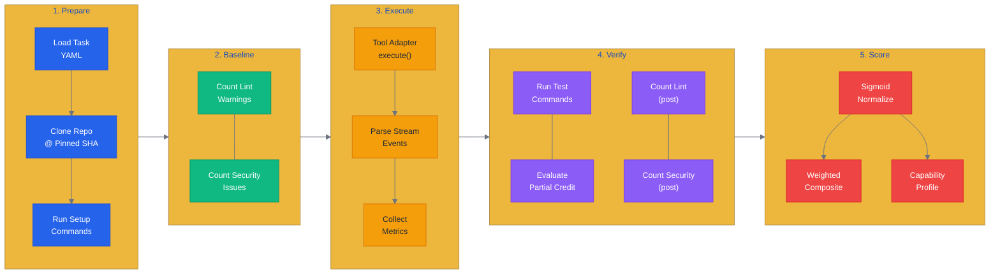
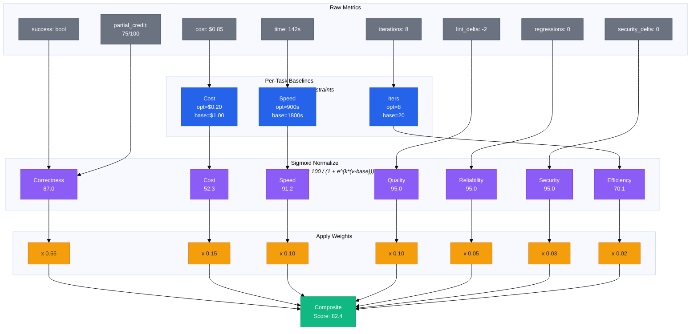
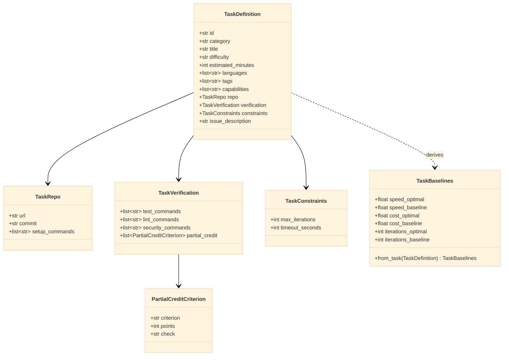
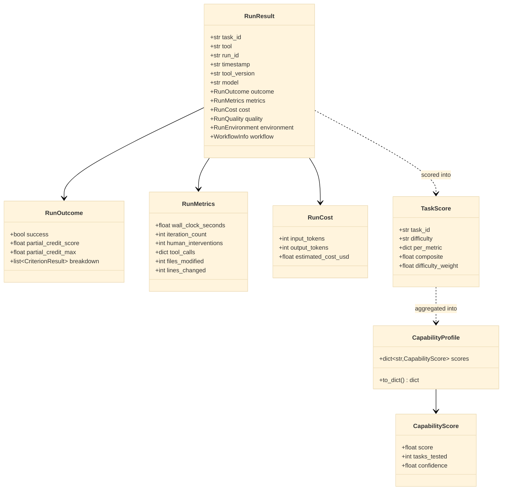
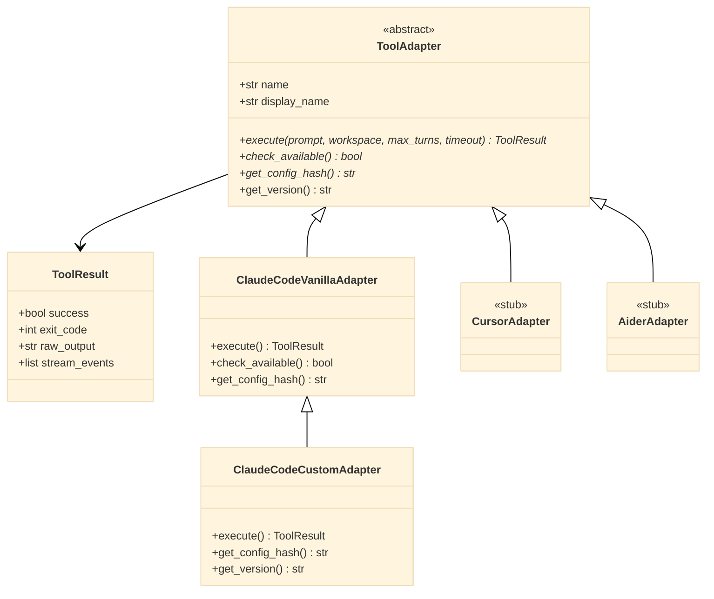

# AWB Architecture

## System Overview

AWB is a CLI tool with primary commands for running benchmarks, analyzing results, and maintaining task quality. The diagram below shows how each command maps to its backend engine. Commands are color-coded by function: blue for benchmark execution and comparison, amber for analysis and submission workflows, and green for validation and reporting utilities. This separation matters because benchmark execution (blue path) is the hot path that must handle timeouts, subprocess management, and async I/O, while analysis (amber path) operates on saved results and can run without any tool installed.

```mermaid
%%{init: {'theme': 'base', 'themeVariables': {'primaryColor': '#2563eb', 'primaryTextColor': '#ffffff', 'primaryBorderColor': '#1d4ed8', 'secondaryColor': '#f59e0b', 'secondaryTextColor': '#1f2937', 'tertiaryColor': '#10b981', 'tertiaryTextColor': '#ffffff', 'lineColor': '#6b7280', 'fontSize': '14px'}}}%%
graph TB
    CLI["awb CLI<br/><i>Click-based</i>"]:::primary

    CLI --> Run["awb run"]:::primary
    CLI --> Gap["awb gap"]:::secondary
    CLI --> Compare["awb compare"]:::primary
    CLI --> Submit["awb submit"]:::secondary
    CLI --> Validate["awb validate"]:::tertiary
    CLI --> Leaderboard["awb leaderboard"]:::tertiary
    CLI --> Stability["awb stability"]:::secondary
    CLI --> CalDiff["awb calibrate-difficulty"]:::secondary
    CLI --> CalTime["awb calibrate-timeouts"]:::secondary

    Run --> Runner["BenchmarkRunner<br/><i>core/runner.py</i>"]:::primary
    Gap --> GapEngine["GapReport<br/><i>analysis/gap_analysis.py</i>"]:::secondary
    Compare --> CompareEngine["compare_submissions<br/><i>submission/compare.py</i>"]:::secondary
    Stability --> StabilityEngine["TaskStability<br/><i>scoring/stability.py</i>"]:::secondary
    CalDiff --> CalDiffEngine["calibrate_difficulty<br/><i>analysis/calibrate_difficulty.py</i>"]:::secondary
    CalTime --> CalTimeEngine["calibrate_timeouts<br/><i>analysis/calibrate_timeouts.py</i>"]:::secondary

    classDef primary fill:#2563eb,stroke:#1d4ed8,color:#fff
    classDef secondary fill:#f59e0b,stroke:#d97706,color:#1f2937
    classDef tertiary fill:#10b981,stroke:#059669,color:#fff
```



## Benchmark Run Pipeline

This is the core of what AWB does. Every benchmark run follows this exact five-stage pipeline, and understanding it is essential to understanding why scores come out the way they do.

**Stage 1 (Prepare)** clones the target repo at a pinned commit SHA and runs setup commands (venv creation, dependency installation). This ensures every tool starts from identical state — no run inherits artifacts from a previous one.

**Stage 2 (Baseline)** counts lint warnings and security findings *before* the AI tool touches anything. This baseline is compared against post-run counts to measure whether the tool improved or degraded code quality, rather than penalizing tools for pre-existing issues in the repo.

**Stage 3 (Execute)** hands the task prompt to the tool adapter, which runs the AI tool as a subprocess. Stream events (token counts, tool calls, model info) are parsed in real-time to capture cost and iteration metrics without waiting for the tool to finish.

**Stage 4 (Verify)** runs the test suite, evaluates partial credit criteria, and re-counts lint/security issues. This is completely tool-agnostic — every tool is measured by the same test commands and rubric, ensuring fair comparison.

**Stage 5 (Score)** normalizes all raw metrics through sigmoid curves with per-task baselines, then produces both a weighted composite score and a capability profile mapping results to the 8 capability dimensions.



## Module Dependency Graph

This diagram shows how AWB's 7 packages depend on each other. The architecture follows a strict layered pattern: the CLI layer at the top orchestrates everything but contains no logic itself; the Core layer owns execution and data; Adapters, Verification, and Scoring are peer modules that the Core layer calls; Analysis and Submission sit on top of Scoring and operate on saved results.

The key design constraint visible here is that **Scoring never depends on Core** (no circular dependency). Scoring modules only know about dataclasses defined in `config.py`, not about the runner or adapters. This means scoring can be tested and used independently — you can score an externally submitted JSON file without any AI tool installed.

The Adapter inheritance is also visible: `ClaudeCodeCustomAdapter` extends `ClaudeCodeVanillaAdapter`, adding the user's `~/.claude` configuration on top of the vanilla baseline. This inheritance is what makes the vanilla-vs-custom comparison fair — they share all execution logic and differ only in configuration.

```mermaid
%%{init: {'theme': 'base', 'themeVariables': {'fontSize': '13px', 'lineColor': '#6b7280'}}}%%
graph TD
    subgraph CLI_Layer["CLI Layer"]
        CLI["cli.py"]:::blue
    end

    subgraph Core["Core"]
        Config["config.py<br/><i>Dataclasses,<br/>weights, paths</i>"]:::gray
        TaskLoader["task_loader.py<br/><i>YAML + schema<br/>validation</i>"]:::gray
        Runner["runner.py<br/><i>Async orchestrator</i>"]:::gray
        RepoMgr["repo_manager.py<br/><i>Git clone + setup</i>"]:::gray
        Results["results.py<br/><i>JSON save/load</i>"]:::gray
        MetricCol["metrics.py<br/><i>Token counting,<br/>timing</i>"]:::gray
    end

    subgraph Adapters["Adapters"]
        Base["base.py<br/><i>ToolAdapter ABC</i>"]:::orange
        Registry["registry.py"]:::orange
        CCVanilla["claude_code.py<br/><i>Vanilla</i>"]:::orange
        CCCustom["claude_code.py<br/><i>Custom</i>"]:::orange
    end

    subgraph Verification["Verification"]
        TestRun["test_runner.py"]:::green
        PartialC["partial_credit.py"]:::green
        LintChk["lint_checker.py"]:::green
        SecScan["security_scanner.py"]:::green
        DiffAna["diff_analyzer.py"]:::green
    end

    subgraph Scoring["Scoring"]
        Normalize["normalize.py<br/><i>sigmoid_normalize</i>"]:::purple
        Baselines["baselines.py<br/><i>TaskBaselines</i>"]:::purple
        Composite["composite.py<br/><i>Per-task + aggregate</i>"]:::purple
        Capabilities["capabilities.py<br/><i>Capability radar</i>"]:::purple
        Stats["statistics.py<br/><i>CI, significance</i>"]:::purple
        Integrity["integrity.py<br/><i>Contamination<br/>detection</i>"]:::purple
        Stability["stability.py<br/><i>TaskStability,<br/>variance weighting</i>"]:::purple
        Report["report.py"]:::purple
    end

    subgraph Analysis["Analysis"]
        GapAnalysis["gap_analysis.py<br/><i>Failure analysis,<br/>pattern detection</i>"]:::red
        Suggestions["suggestions.py<br/><i>Rule-based<br/>recommendations</i>"]:::red
        CalDiffEngine["calibrate_difficulty.py<br/><i>Empirical pass rate<br/>recalibration</i>"]:::red
        CalTimeEngine["calibrate_timeouts.py<br/><i>p95-based timeout<br/>tightening</i>"]:::red
    end

    subgraph Submission["Submission"]
        SubSchema["schema.py<br/><i>Hardware classes,<br/>dataclasses</i>"]:::teal
        Ingest["ingest.py<br/><i>Parse + validate</i>"]:::teal
        Compare["compare.py<br/><i>Cross-submission</i>"]:::teal
    end

    CLI --> Runner
    CLI --> GapAnalysis
    CLI --> Ingest
    CLI --> Compare

    Runner --> TaskLoader
    Runner --> RepoMgr
    Runner --> Registry
    Runner --> MetricCol
    Runner --> Results
    Runner --> TestRun
    Runner --> PartialC
    Runner --> LintChk
    Runner --> SecScan

    TaskLoader --> Config
    Composite --> Normalize
    Composite --> Baselines
    Capabilities --> Normalize
    Capabilities --> Baselines
    Report --> Composite
    Report --> Capabilities
    GapAnalysis --> Capabilities
    GapAnalysis --> Suggestions
    Compare --> Stats

    Registry --> Base
    CCVanilla --> Base
    CCCustom --> CCVanilla

    classDef blue fill:#2563eb,stroke:#1d4ed8,color:#fff
    classDef gray fill:#6b7280,stroke:#4b5563,color:#fff
    classDef orange fill:#f59e0b,stroke:#d97706,color:#1f2937
    classDef green fill:#10b981,stroke:#059669,color:#fff
    classDef purple fill:#8b5cf6,stroke:#7c3aed,color:#fff
    classDef red fill:#ef4444,stroke:#dc2626,color:#fff
    classDef teal fill:#14b8a6,stroke:#0d9488,color:#fff
```



## Scoring Pipeline

This diagram traces how a single task's raw metrics become a composite score. It is the most important diagram for understanding AWB's scoring system and why it produces the scores it does.

The pipeline has four layers. **Raw Metrics** (gray) are the direct measurements: did tests pass, how many partial credit points were earned, how much did it cost, how long did it take. **Per-Task Baselines** (blue) are derived from the task's difficulty level — a hard task costing $2.00 is scored differently than an easy task costing $2.00, because the baselines are $1.00/$3.00 for hard vs $0.05/$0.30 for easy. **Sigmoid Normalization** (purple) maps each raw metric to a 0-100 score using the formula `score = 100 / (1 + exp(k * (value - baseline)))`, which produces ~95 at the optimal value, ~50 at the baseline, and smoothly decays toward 0 for worse values without ever going negative. **Weights** (amber) apply the configured importance of each dimension — correctness at 55% dominates because a tool that gets the wrong answer fast and cheap should not outscore one that gets it right.

The composite score at the bottom is the final number that appears on the leaderboard. It ranges from 0 to 100 and is directly comparable across tools, models, and configurations.



## Task Schema

This class diagram shows the data model for a single benchmark task. Every task YAML is validated against a JSON Schema and then parsed into these dataclasses.

The design captures three concerns separately. **TaskRepo** pins the exact code state (URL + commit SHA + setup commands) so every tool starts from identical source. **TaskVerification** defines how success is measured — test commands for binary pass/fail, partial credit criteria for graduated scoring, and lint/security commands for quality deltas. **TaskConstraints** sets the resource limits (max iterations, timeout) so no tool can brute-force its way to a solution by running indefinitely.

**TaskBaselines** is derived at scoring time, not stored in the YAML. It computes per-task scoring baselines from the difficulty level and constraints, ensuring that a 45-minute hard task and a 15-minute easy task are scored on appropriate scales rather than against a single global baseline.

The `capabilities` field on `TaskDefinition` is what enables capability profiling — each task declares which 1-3 skills it tests (e.g., `bug_diagnosis`, `multi_file_reasoning`), and aggregate scores per capability reveal where a workflow is strong or weak.



## Result Data Model

This class diagram shows what AWB records for each benchmark run and how raw results flow into scored outputs.

**RunResult** is the primary record written to disk as JSON after each task execution. It captures everything needed to reproduce and analyze the run: which task, which tool, which model, the outcome (pass/fail + partial credit breakdown), performance metrics (time, iterations, tool calls), cost (tokens + estimated USD), quality deltas (lint/security changes), and environment (OS, hardware). The `workflow` field optionally captures the tool's configuration hash for reproducibility verification.

**RunOutcome** separates binary success from graduated partial credit. A tool that writes correct code but whose tests fail gets `success=false` but may still earn 80/100 partial credit points — this distinction is critical for gap analysis, which classifies failures differently based on how far the tool got.

**TaskScore** is computed at analysis time (not stored on disk). It holds the sigmoid-normalized per-metric scores and the difficulty-weighted composite. **CapabilityProfile** aggregates TaskScores across all tasks that test a given capability, producing the radar chart data. The `confidence` field on each CapabilityScore reflects sample size — a capability tested by 2 tasks has lower confidence than one tested by 20.



## Gap Analysis Flow

```mermaid
%%{init: {'theme': 'base', 'themeVariables': {'fontSize': '13px'}}}%%
flowchart LR
    subgraph Input["Input"]
        Results["RunResult[]"]:::blue
        Tasks["TaskDefinition[]"]:::blue
    end

    subgraph Classify["Classify Failures"]
        Timeout["timeout<br/><i>>95% of limit</i>"]:::red
        TestErr["test_error<br/><i>Tests written<br/>but fail</i>"]:::red
        PartComp["partial_completion<br/><i>Some criteria<br/>pass</i>"]:::orange
        CodeErr["code_error<br/><i>Zero partial<br/>credit</i>"]:::red
    end

    subgraph Analyze["Pattern Detection"]
        CapWeak["Capability<br/>Weaknesses<br/><i>70%+ fail rate<br/>on a capability</i>"]:::purple
        DiffCliff["Difficulty<br/>Cliff<br/><i>Easy pass,<br/>hard fail</i>"]:::purple
        TokenBurn["Token<br/>Burning<br/><i>>$1 spent<br/>on failures</i>"]:::purple
    end

    subgraph Output["Gap Report"]
        Radar["Capability<br/>Radar"]:::green
        Actions["Ranked<br/>Actions"]:::green
        Suggest["Workflow<br/>Suggestions"]:::green
    end

    Results --> Classify
    Tasks --> Classify
    Classify --> Analyze
    Analyze --> Output

    classDef blue fill:#2563eb,stroke:#1d4ed8,color:#fff
    classDef red fill:#ef4444,stroke:#dc2626,color:#fff
    classDef orange fill:#f59e0b,stroke:#d97706,color:#1f2937
    classDef purple fill:#8b5cf6,stroke:#7c3aed,color:#fff
    classDef green fill:#10b981,stroke:#059669,color:#fff
```

This diagram shows what happens when you run `awb gap`. Unlike scoring (which produces numbers), gap analysis produces *explanations* — it tells you why your workflow scored the way it did and what to change.

The flow has three stages. **Classify Failures** categorizes each non-passing task into one of four failure modes: `timeout` (tool ran out of time), `test_error` (tool wrote code but tests fail — the most common failure mode), `partial_completion` (some criteria pass but not all), and `code_error` (zero partial credit — the tool went completely wrong). This classification matters because each failure mode suggests different improvements.

**Pattern Detection** looks across all failures for systematic weaknesses. It checks whether the tool fails 70%+ of tasks testing a specific capability (e.g., "fails all multi_file_reasoning tasks"), whether there's a difficulty cliff (passes easy, fails hard), and whether the tool burns tokens on tasks it ultimately fails (spending >$1 on a failed task suggests the tool should have stopped earlier).

**Gap Report** synthesizes everything into actionable output: a capability radar showing per-dimension scores, ranked improvement actions based on frequency across failures, and rule-based workflow suggestions mapped to (failure_category, capability) pairs. The suggestions are deterministic (not LLM-generated) so they're reproducible across runs.



## Tool Adapter Interface

This class diagram shows how AWB integrates with different AI coding tools. The `ToolAdapter` abstract base class defines the contract every tool must implement: `execute()` to run the tool on a task, `check_available()` to verify the tool is installed, and `get_config_hash()` to fingerprint the tool's configuration for reproducibility.

The inheritance hierarchy reveals the vanilla-vs-custom comparison design. `ClaudeCodeVanillaAdapter` runs Claude Code with an isolated config directory (`/tmp/awb-vanilla-claude`) and `CLAUDE_SKIP_HOOKS=1`, stripping all workflow customization. `ClaudeCodeCustomAdapter` extends it to use the user's real `~/.claude` directory with all their hooks, agents, skills, and CLAUDE.md intact. Both adapters share the same execution logic — the only difference is the configuration environment. This is what makes the benchmark measure workflow contribution rather than tool capability.

`CursorAdapter` and `AiderAdapter` are stubs awaiting community implementation. The ABC ensures any new adapter will be compatible with the full benchmark pipeline without modifications to the runner, scorer, or CLI.



## Directory Structure

```
ai-workflow-benchmark/
├── awb/
│   ├── cli.py                    # Click CLI (run, gap, compare, export, submit, quickstart, info, etc.)
│   ├── core/
│   │   ├── config.py             # Dataclasses, METRIC_WEIGHTS, paths
│   │   ├── task_loader.py        # YAML + JSON Schema validation
│   │   ├── runner.py             # Async benchmark orchestrator
│   │   ├── repo_manager.py       # Git clone, setup execution
│   │   ├── results.py            # JSON save/load for RunResult
│   │   ├── metrics.py            # Token counting, stream parsing
│   │   └── timeout.py            # Task timeout wrapper
│   ├── adapters/
│   │   ├── base.py               # ToolAdapter ABC, ToolResult
│   │   ├── registry.py           # Adapter registration
│   │   ├── claude_code.py        # Vanilla + Custom variants
│   │   ├── cursor.py             # Stub
│   │   └── aider.py              # Stub
│   ├── verification/
│   │   ├── test_runner.py        # Run test_commands
│   │   ├── partial_credit.py     # Evaluate rubric criteria
│   │   ├── lint_checker.py       # Count lint issues (pre/post)
│   │   ├── security_scanner.py   # Count security issues
│   │   ├── diff_analyzer.py      # Analyze git diff
│   │   └── code_review_scorer.py # Review scoring
│   ├── scoring/
│   │   ├── normalize.py          # sigmoid_normalize + wrappers
│   │   ├── baselines.py          # TaskBaselines from difficulty
│   │   ├── composite.py          # Per-task + aggregate scoring
│   │   ├── capabilities.py       # Capability enum + radar
│   │   ├── statistics.py         # CI, significance testing
│   │   ├── integrity.py          # Contamination detection
│   │   ├── stability.py          # TaskStability: std_dev, score_range, is_unstable
│   │   ├── report.py             # ScoreReport + printing
│   │   ├── workflow_lift.py      # Workflow Lift Score (custom vs vanilla)
│   │   └── weights.yaml          # 3 weight profiles
│   ├── analysis/
│   │   ├── gap_analysis.py       # FailureAnalysis, GapReport
│   │   ├── suggestions.py        # Rule-based recommendations
│   │   ├── calibrate_difficulty.py  # Recalibrate difficulty from empirical pass rates
│   │   └── calibrate_timeouts.py    # Tighten timeouts from empirical p95 data
│   ├── submission/
│   │   ├── schema.py             # Hardware classes, Submission
│   │   ├── ingest.py             # Parse + validate JSON
│   │   └── compare.py            # Cross-submission comparison
│   ├── workflow/
│   │   ├── descriptor.py         # Load, validate, hash
│   │   └── exporter.py           # Export current config
│   ├── leaderboard/
│   │   ├── generate.py           # HTML generation
│   │   ├── templates/            # Jinja2 templates
│   │   └── static/               # CSS/JS
│   └── tasks/
│       ├── schema.json           # Task YAML JSON Schema
│       ├── _template.yaml        # Task template
│       ├── bug-fix/              # 13 tasks (BF-001 to BF-014, no BF-002)
│       ├── feature-addition/     # 12 tasks (FA-001 to FA-012)
│       ├── refactoring/          # 12 tasks (RF-001 to RF-012)
│       ├── code-review/          # 10 tasks (CR-001 to CR-010)
│       ├── debugging/            # 11 tasks (DB-001 to DB-011)
│       ├── multi-file/           # 10 tasks (MF-001 to MF-010)
│       └── legacy-code/          # 12 tasks (LC-001 to LC-012)
├── tests/                        # pytest suite (75 tests)
├── results/
│   ├── schema.json               # Result JSON Schema
│   ├── submission-schema.json    # External submission schema
│   └── runs/                     # Run outputs (gitignored)
├── scripts/                      # Utility scripts
├── README.md
├── METHODOLOGY.md
├── ARCHITECTURE.md
└── pyproject.toml                # v0.4.1
```
