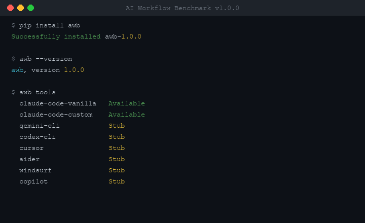

<div align="center">
  <h1>AI Workflow Benchmark (AWB)</h1>
  <p><strong>Measure AI coding tool+workflow performance, not just model capability.</strong></p>
  <p>
    <a href="https://pypi.org/project/awb/"></a>
    <a href="https://github.com/xmpuspus/ai-workflow-benchmark/actions"></a>
    
    
    <a href="LICENSE"></a>
  </p>
  <br/>
  
  <br/>
  <sub>Install from PyPI, validate 80 tasks, run vanilla vs custom, get capability profiles and improvement suggestions.</sub>
</div>

---

## Why This Exists

SWE-bench tests models. AWB tests workflows. The same model running vanilla Claude Code vs. a purpose-built setup with a tuned CLAUDE.md, hooks, and structured agents produces meaningfully different results on real engineering tasks. No existing benchmark captures that gap — they all evaluate the model in isolation.

AWB benchmarks the full stack: **tool + configuration + workflow + model**, together, on 80 tasks drawn from real open-source repositories.

## Quick Start

```bash
pip install awb

awb quickstart                    # verify your setup
awb run --runs 3                  # full benchmark (3 runs each for stable scores)
awb gap results/runs/<run_dir>/   # analyze capability gaps
```

## How It Works

```
Clone repo at pinned SHA
  → Run setup commands
  → Capture baseline lint/security counts
  → Execute tool with task prompt
  → Run test suite + partial credit rubric
  → Sigmoid-normalize 7 metrics
  → Produce weighted composite + capability profile
```

Each task starts from a fresh `git clone` at a pinned commit. Every tool gets the same prompt, the same timeout, and the same verification suite. Results are scored with sigmoid normalization so scores are never negative and never collapse at the boundary.

## Scoring System

Seven dimensions, sigmoid-normalized with per-task baselines derived from difficulty:

| Dimension | Weight | What It Measures |
|-----------|--------|-----------------|
| Correctness | 55% | Pass/fail (60%) + partial credit rubric (40%) |
| Cost efficiency | 15% | Estimated USD per task |
| Speed | 10% | Wall-clock seconds vs. estimated task time |
| Code quality | 10% | Lint warning delta (pre vs. post) |
| Reliability | 5% | Pre-existing tests broken by the change |
| Security | 3% | New security issues introduced |
| Efficiency | 2% | Tool turns used vs. task max |

**Sigmoid curve:** `score = 100 / (1 + exp(k * (value - baseline)))`

- Optimal performance (excellent) → ~95
- Baseline performance (adequate) → ~50
- Above baseline → smooth decay, never negative

**Difficulty-weighted aggregation:** hard tasks count 2.5×, medium 1.5×, easy 1.0×. A tool that solves hard tasks beats one that only solves easy ones even if the easy-task count is higher.

**Per-task baselines by difficulty:**

| Metric | Easy | Medium | Hard |
|--------|------|--------|------|
| Cost optimal / baseline | $0.05 / $0.30 | $0.20 / $1.00 | $1.00 / $3.00 |
| Speed | 50% / 100% of estimated_minutes | same | same |
| Iterations | 3 / max_iters | 8 / max_iters | 15 / max_iters |

## The 80 Tasks

Real open-source repos, pinned to release tag SHAs. Setup runs in under 15 seconds via venv + pip (Python) or npm (TypeScript).

| Category | Count | Easy / Med / Hard | What It Tests |
|----------|-------|-------------------|---------------|
| bug-fix | 14 | 3 / 5 / 4 | Root cause analysis, test-first diagnosis, N+1 queries, race conditions |
| feature-addition | 12 | 4 / 5 / 2 | Convention adherence, ambiguous requirements, Dockerfiles, documentation, TypeScript typing |
| refactoring | 12 | 4 / 3 / 2 | Multi-file consistency, O(n^2) optimization, CI/CD config, async migration |
| code-review | 10 | 2 / 5 / 2 | Security review (report-only), concurrency analysis, migration guides, OWASP |
| debugging | 11 | 2 / 3 / 5 | Performance profiling, regression bisection, stack trace diagnosis, environment bugs |
| multi-file | 10 | 0 / 4 / 4 | Merge conflicts, Pydantic v1->v2 migration, plugin systems, auth chains |
| legacy-code | 12 | 4 / 4 / 4 | SQLAlchemy 2.0 migration, 20-file codebase navigation, dead code removal |

**Repos used:** FastAPI, httpx, Flask, Starlette, Click, Pydantic, SQLAlchemy 2.0, Hono

**Task IDs:**
`BF-001–014` · `FA-001–012` · `RF-001–012` · `CR-001–010` · `DB-001–011` · `MF-001–010` · `LC-001–012`

## Capability Profiles

Each task maps to 1–3 capabilities, producing a radar chart of tool strengths:

| Capability | Tasks | What It Measures |
|------------|-------|-----------------|
| code_comprehension | 41 | Understanding existing code before modifying |
| framework_knowledge | 35 | Knowing API patterns (Pydantic v2, async SQLAlchemy, etc.) |
| bug_diagnosis | 26 | Structured root cause analysis, test-first diagnosis |
| refactoring_discipline | 26 | Changing code without breaking behavior |
| multi_file_reasoning | 23 | Coordinating changes across multiple files |
| test_writing | 10 | Writing correct, meaningful tests |
| security_awareness | 10 | Identifying and fixing vulnerabilities |
| cost_discipline | derived | Token efficiency across all tasks |

Example `awb gap` output:

```
Capability Profile
------------------
code_comprehension    ████████████████████  82.4  (n=27, conf=high)
framework_knowledge   ████████████████░░░░  68.1  (n=26, conf=high)
refactoring_discipline████████████████░░░░  65.3  (n=23, conf=high)
multi_file_reasoning  ████████████░░░░░░░░  51.2  (n=20, conf=high)
bug_diagnosis         ███████████████░░░░░  63.7  (n=17, conf=med)
test_writing          ██████████░░░░░░░░░░  44.1  (n=8,  conf=low)
security_awareness    █████████████░░░░░░░  55.8  (n=8,  conf=low)

Systematic Patterns
-------------------
- Fails 70%+ of multi_file_reasoning tasks → consider multi-agent workflows
- Token spend on failed hard tasks: $4.20 → add early-exit heuristics
- No failures on easy tasks → baseline is solid

Top Suggestions
---------------
1. Enable subagent mode for tasks spanning >3 files (impact: high)
2. Add repo-level CLAUDE.md with architecture overview (impact: medium)
3. Use --think flag for debugging tasks (impact: medium)
```

## Workflow Lift Score

When `awb run` executes both vanilla and custom (the default), it produces a **Workflow Lift** — a single number measuring how much your workflow configuration improves over the raw model:

```
Workflow Lift: +4.2 pts  (p=0.031, significant)
  Pass rate: vanilla 62% vs custom 68%
  Wins: custom 8 / vanilla 3 / ties 69

  Where your workflow helps:
    bug diagnosis             +12.3 pts  (17 tasks)
    multi file reasoning       +8.1 pts  (20 tasks)
    security awareness         +5.4 pts  (10 tasks)

  Where it hurts:
    cost discipline            -4.2 pts  (80 tasks)

  Biggest task-level differences:
    BF-014   +40  (V=35 C=75)
    LC-012   +15  (V=65 C=80)
```

The lift is computed per-task (configured score minus vanilla score), averaged across all tasks, and tested for statistical significance. Capability-level breakdowns show where your workflow configuration actually helps vs. adds overhead.

## CLI Reference

| Command | Description |
|---------|-------------|
| `awb run [tool] [options]` | Run benchmark tasks |
| `awb gap <run_dir>` | Analyze capability gaps and generate improvement suggestions |
| `awb compare <run1> <run2>` | Compare two runs with significance testing |
| `awb export <run_dir> -o file.json` | Export results in external submission format |
| `awb submit <file.json>` | Validate and display an external submission |
| `awb compare-submissions <a.json> <b.json>` | Cross-tool comparison with statistics |
| `awb quickstart` | Verify setup: tools available, tasks load, validation passes |
| `awb info <task_id>` | Show task details |
| `awb tools` | List registered adapters and availability |
| `awb validate` | Validate all task YAMLs against schema |
| `awb leaderboard` | Generate HTML leaderboard from run results |
| `awb workflow <subcommand>` | Export, validate, diff, or init workflow descriptors |

**Common options for `awb run`:**

```bash
awb run                            # all tools, all tasks, 3 runs
awb run claude-code-custom         # single tool
awb run -t BF-001                  # single task
awb run --category legacy-code     # filter by category
awb run --difficulty hard          # filter by difficulty
awb run --capability bug_diagnosis # filter by capability
awb run --runs 1 --dry-run        # preview without executing
```

## Adding Tasks

Tasks live in `awb/tasks/<category>/`. Copy `awb/tasks/_template.yaml`:

```yaml
id: BF-012
category: bug-fix
title: "Fix response_model silently dropping extra fields in FastAPI"
difficulty: easy
estimated_minutes: 15
languages: [python]
capabilities: [framework_knowledge, test_writing]

repo:
  url: "https://github.com/tiangolo/fastapi"
  commit: "628c34e0"
  setup_commands:
    - "python3 -m venv .venv && source .venv/bin/activate && pip install -e '.[all]'"

issue:
  description: |
    The endpoint's response_model silently strips extra fields...
  files_to_examine:
    - "fastapi/routing.py"

verification:
  test_commands:
    - "source .venv/bin/activate && python3 -m pytest tests/test_extra_fields.py -v"
  partial_credit:
    - criterion: "Uses Pydantic v2 ConfigDict"
      points: 50
      check: "grep -q 'ConfigDict' tests/test_extra_fields.py"
    - criterion: "Tests pass"
      points: 50
      check: "source .venv/bin/activate && python3 -m pytest tests/test_extra_fields.py -v"

constraints:
  max_iterations: 20
  timeout_seconds: 1800
```

Run `awb validate` to check your task before opening a PR. Full guide: [CONTRIBUTING.md](CONTRIBUTING.md)

## Adding Tools

Implement the `ToolAdapter` ABC in `awb/adapters/`:

```python
from awb.adapters.base import ToolAdapter, ToolResult
from pathlib import Path

class MyToolAdapter(ToolAdapter):
    name = "my-tool"
    display_name = "My Tool"

    async def execute(self, prompt: str, workspace: Path,
                      max_turns: int = 20, timeout_seconds: int = 1800) -> ToolResult:
        ...

    def check_available(self) -> bool:
        ...

    def get_config_hash(self) -> str:
        ...
```

Register in `awb/adapters/registry.py` and add an entry point in `pyproject.toml`.

## External Submissions

Anyone can share results using the submission format defined in `results/submission-schema.json`:

```bash
awb run --runs 3
awb export results/runs/<run_dir>/ -o my-results.json
awb submit my-results.json                        # validate locally
awb compare-submissions a.json b.json             # compare with significance testing
```

The format captures tool version, model, hardware class, and per-task run results. Hardware classes (e.g., `apple_m5_24gb`, `linux_x86_16gb`) enable fair speed comparisons — only compared within the same tier.

## Statistical Framework

- Confidence intervals via t-distribution (no scipy required for core scoring)
- Significance testing via sign test for paired tool comparison
- Integrity checks: contamination detection (completions <10s flagged), variance anomalies (identical times/tokens across runs)
- Weight profiles: `default`, `correctness_focused`, `production` (see `awb/scoring/weights.yaml`)

## Links

- [Methodology](METHODOLOGY.md) — Fair comparison principles, metric definitions, known limitations
- [Architecture](ARCHITECTURE.md) — Module graph, data models, pipeline diagrams
- [Contributing](CONTRIBUTING.md) — Adding tasks, tools, and submitting results
- [PyPI](https://pypi.org/project/awb/) — `pip install awb`

## License

MIT
